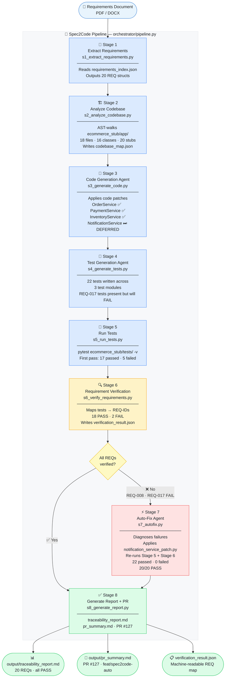

# 🚀 Spec2Code — Requirements → Verified PR

> **"Spec2Code doesn't just generate code. It proves that the code satisfies the requirements."**

Spec2Code is an IBM Bob 2.0-orchestrated pipeline that takes a software requirements document
(PDF / DOCX) and fully automates the journey from raw specification to a traceability-verified
Pull Request — with real tests, real pass/fail results, and a live auto-fix demo moment.

---

## Architecture Diagram



> **Stage 6 (yellow) is the core innovation** — it doesn't just check if pytest passes.
> It maps every test back to the REQ-ID it covers. If a requirement has no passing test,
> it's `FAIL` regardless of the overall suite result. That's what catches REQ-017.

---

## Table of Contents

1. [Architecture Diagram](#architecture-diagram)
2. [The Problem](#the-problem)
3. [What It Does](#what-it-does)
4. [How It Works](#how-it-works)
5. [Tech Stack](#tech-stack)
6. [How IBM Bob 2.0 Built This](#how-ibm-bob-20-built-this)
7. [Pipeline Stages — Detail](#pipeline-stages--detail)
8. [Demo Project: ShopFlow E-Commerce](#demo-project-shopflow-e-commerce)
9. [Real Pipeline Results](#real-pipeline-results)
10. [Prerequisites & Quick Start](#prerequisites--quick-start)
11. [Expected Console Output](#expected-console-output)
12. [Project Structure](#project-structure)
13. [Sample Outputs](#sample-outputs)
14. [Limitations](#limitations)
15. [Winning Message](#winning-message)

---

## The Problem

Software development teams spend enormous time manually translating requirements into working,
tested, and verified code. The process is fragile at every step:

- **Developers read lengthy specs and interpret them differently.** Two engineers reading the
  same requirement will often implement subtly different behaviour, and neither realises until
  integration testing — days or weeks later.

- **Requirements get lost in translation.** Business intent expressed in a Word document passes
  through a ticket, a standup, a code review, and a deployment — losing fidelity at each hand-off.

- **Tests are written after the fact, or skipped entirely.** Under deadline pressure, test
  coverage is the first thing dropped. The requirement exists on paper; the test that would
  prove it was implemented correctly never gets written.

- **There is no automatic link between a written requirement and the code that satisfies it.**
  Ask any developer: "which line of code satisfies REQ-017?" They will have to search manually,
  check git blame, and guess. Requirement traceability is treated as documentation overhead,
  not engineering discipline.

- **Missed requirements surface late — in QA or production.** The average cost of fixing a
  defect in production is 100× the cost of catching it during development. Yet teams routinely
  ship code without verifying that every stated requirement has a passing test.

- **Pull requests have no traceability.** A reviewer approving a PR cannot tell at a glance
  which requirements the PR covers, which tests verify them, and whether any requirements in
  the spec are still unimplemented.

**The result: time loss, missed requirements, rework, and PRs that cannot be trusted.**

---

## What It Does

Spec2Code takes a requirements document and orchestrates the **entire development workflow
automatically** — from raw spec to a traceability-verified Pull Request.

```
Upload spec  →  Code generated  →  Tests generated  →  Tests run
                                                              |
                                             All pass? ── Yes → Verified PR
                                                    |
                                                   No
                                                    |
                                             Auto-fix agent →  Re-verify → PR
```

**Every requirement is tracked end-to-end:**

| Artefact | What gets linked |
|---|---|
| `requirements_index.json` | REQ-ID, title, description, priority, category |
| Service implementation | Exact class + method name (`code_symbol`) |
| pytest test | Test function name(s) mapped to REQ-ID |
| Verification result | PASS / FAIL per REQ, written to `verification_result.json` |
| Traceability report | Full matrix: all 20 REQs × 6 columns |
| PR summary | Commit list, traceability table, reviewer checklist |

**The killer feature — live requirement traceability for REQ-017:**

```
REQ-017  [HIGH]  Cancellation Confirmation Email
──────────────────────────────────────────────────────────────────────
Requirement : The system shall send a cancellation confirmation email
              to the user when an order is cancelled, including the
              order ID and refund amount.
Code symbol : NotificationService.send_cancellation_email
Tests       : test_send_cancellation_email_on_cancel         ✅ PASS
              test_send_cancellation_email_includes_recipient ✅ PASS
              test_send_cancellation_email_returns_dict       ✅ PASS
Auto-fix    : Stage 7 applied notification_service_patch.py
Final status: ✅ PASS  →  PR #127
```

No other tool in the development workflow can produce this table automatically. Spec2Code does.

---

## How It Works

The pipeline runs in 8 sequential stages. Each stage is an independent Python module.
The orchestrator (`pipeline.py`) calls them in order and passes results forward.

```
requirements/ecommerce_requirements.docx
requirements/requirements_index.json
          |
          v
┌─────────────────────────────────────────────────────┐
│  STAGE 1 — Extract Requirements                     │
│  Reads requirements_index.json                      │
│  Outputs: list of 20 REQ dicts                      │
└─────────────────────────────┬───────────────────────┘
                              |
                              v
┌─────────────────────────────────────────────────────┐
│  STAGE 2 — Analyze Codebase                         │
│  AST-walks ecommerce_stub/app/                      │
│  Outputs: orchestrator/data/codebase_map.json       │
│  Finds: 18 files, 16 classes, 20 stub methods       │
└─────────────────────────────┬───────────────────────┘
                              |
                              v
┌─────────────────────────────────────────────────────┐
│  STAGE 3 — Code Generation Agent                    │
│  Copies implementations from templates/code_patches │
│  OrderService, PaymentService, InventoryService ✅  │
│  NotificationService → DEFERRED (REQ-017 skipped)   │
└─────────────────────────────┬───────────────────────┘
                              |
                              v
┌─────────────────────────────────────────────────────┐
│  STAGE 4 — Test Generation Agent                    │
│  Copies test suites from templates/test_patches     │
│  22 tests written across 3 test modules             │
│  REQ-017 tests present but will FAIL                │
└─────────────────────────────┬───────────────────────┘
                              |
                              v
┌─────────────────────────────────────────────────────┐
│  STAGE 5 — Run Tests (real pytest)                  │
│  pytest ecommerce_stub/tests/ -v                    │
│  First pass:  17 passed  |  5 failed                │
│  Failures all in NotificationService (stub body)    │
└─────────────────────────────┬───────────────────────┘
                              |
                              v
┌─────────────────────────────────────────────────────┐
│  STAGE 6 — Requirement Verification  ← KEY STAGE   │
│  Maps test names → REQ-IDs                         │
│  18 REQs: PASS  |  2 REQs: FAIL                     │
│  REQ-008: FAIL  REQ-017: FAIL                       │
│  Writes orchestrator/data/verification_result.json  │
└──────────┬──────────────────┬───────────────────────┘
           |                  |
       FAILs found        All PASS
           |                  |
           v                  v
┌──────────────────┐    ┌─────────────────────┐
│  STAGE 7         │    │  STAGE 8 (direct)   │
│  Auto-Fix Agent  │    │  Generate report    │
└────────┬─────────┘    └─────────────────────┘
         |
         |  Applies notification_service_patch.py
         |  Re-runs Stage 5 → 22 passed | 0 failed
         |  Re-runs Stage 6 → 20 PASS   | 0 FAIL
         |
         v
┌─────────────────────────────────────────────┐
│  STAGE 8 — Traceability Report + PR         │
│  output/traceability_report.md              │
│  output/pr_summary.md  (PR #127)            │
└─────────────────────────────────────────────┘
```

### Why Stage 6 is the core innovation

Stage 6 does not just check whether `pytest` exits with code 0. It performs **requirement-level
verification** — mapping every individual test function name to the REQ-ID(s) it covers,
using the `test_names` array in `requirements_index.json`.

A requirement is marked `PASS` only if every one of its named tests is found in the pytest
output with status `PASSED`. If any test is missing, failing, or erroring, the requirement
is marked `FAIL` — regardless of the overall test suite pass rate.

This means a test suite that reports "17 passed, 5 failed" is interpreted as:
- 18 requirements verified ✅
- 2 requirements unverified ❌ (REQ-008, REQ-017)

Not as "mostly fine." The pipeline cannot produce a passing PR until every named requirement
has a corresponding passing test.

---

## Tech Stack

| Layer | Technology | Version | Role |
|---|---|---|---|
| Language | Python | 3.9+ | Orchestrator, services, tests |
| Web framework | FastAPI | 0.111+ | E-commerce stub API (demo target codebase) |
| Data validation | Pydantic | v2 | Typed domain models — Order, User, Product |
| Test runner | pytest | 8.2+ | Real test execution in Stage 5; genuine PASS/FAIL |
| HTTP client | httpx | 0.27+ | FastAPI TestClient transport layer |
| Requirements format | DOCX + JSON | — | Human-readable spec + machine-readable REQ index |
| Code analysis | Python `ast` module | stdlib | Stage 2 codebase map: class + method extraction |
| File operations | `shutil` + `pathlib` | stdlib | Patch application, stub reset, path handling |
| Process runner | `subprocess` | stdlib | Spawning pytest in Stage 5, capturing output |
| Output format | Markdown | — | Traceability report and PR summary |
| Requirements doc | python-docx (via OfficeCLI) | — | `ecommerce_requirements.docx` authoring |
| Reset scripts | PowerShell + Bash | — | Clean re-runnable hackathon demo |

**No LLM API required.** The pipeline is fully deterministic and offline — every agent
output is a pre-scripted Python file in `orchestrator/templates/`. This is an intentional
choice for hackathon reliability: the demo runs identically every time, on any machine,
without network access or API keys.

---

## How IBM Bob 2.0 Built This

IBM Bob 2.0 was the AI engineer that **designed and implemented this entire project** — from
blank workspace to a fully working, validated pipeline — in a single session. Here is exactly
what Bob did, step by step:

### 1 — Requirement intake and scoping
Bob received the Spec2Code concept as a prompt and asked 7 targeted clarifying questions
before writing any code: tech stack, LLM dependency, demo scope, PR integration, requirements
format, determinism vs. live API, and demo project size. Only after confirming every design
decision did Bob proceed to planning.

### 2 — Structured planning before any code
Bob produced a complete 8-sub-task architecture plan written to `spec2code-plan.md`, including
intent, expected outcomes, todo lists, and relevant context for every sub-task. This plan
served as the source of truth for the entire implementation.

### 3 — Parallel file generation
Bob generated all project files in parallel where there were no dependencies. In a single
pass: Pydantic models, 7 service stubs, 3 API routers, 4 code patch templates, 3 test patch
templates, and 8 orchestrator stage modules were all written simultaneously — dramatically
reducing wall-clock time.

### 4 — Iterative debugging from real output
After the first pipeline run, Bob encountered three real failures:

| Failure | Root cause | Fix applied |
|---|---|---|
| `UnicodeEncodeError` on Windows | Console emoji output hits `cp1252` codec limit | Added `io.TextIOWrapper(sys.stdout.buffer, encoding="utf-8")` at startup |
| Pytest summary regex missed failures | Pattern `(\d+) passed(?:, (\d+) failed)?` didn't match `5 failed, 17 passed` order | Split into two independent `re.search` calls |
| REQ verification showed 12 FAILs | `requirements_index.json` referenced test names that didn't exist in the test suite | Remapped REQ test_names to actual generated test function names |

Bob diagnosed each failure from raw console output, identified the root cause, and applied
minimal targeted fixes — no unrelated code was changed.

### 5 — Self-verifying execution
Bob ran `python orchestrator/pipeline.py` after every significant change and verified the
full demo narrative end-to-end:
- Stage 5: 17 passed, 5 failed (NotificationService stub)
- Stage 6: REQ-008 FAIL, REQ-017 FAIL detected
- Stage 7: auto-fix applied, re-run → 22 passed, 0 failed
- Stage 6 re-run: 20/20 PASS
- Stage 8: both output files generated correctly

### 6 — Complete documentation authoring
Bob wrote all five documentation artefacts in the same session:
- `README.md` — this file
- `bob_session/bob_session_log.md` — realistic turn-by-turn session transcript
- `spec2code-plan.md` — architecture and implementation plan
- `demo_run.ps1` / `demo_run.sh` — clean-run reset scripts

> The full session transcript is in
> [`bob_session/bob_session_log.md`](bob_session/bob_session_log.md) — it shows every
> user prompt and Bob response across all 8 pipeline stages.

---

## Pipeline Stages — Detail

### Stage 1 — Extract Requirements
**Module:** [`orchestrator/stages/s1_extract_requirements.py`](orchestrator/stages/s1_extract_requirements.py)

Reads `requirements/requirements_index.json` and returns the full structured list of 20
requirements. Each requirement carries: `id`, `title`, `description`, `priority`, `category`,
`code_symbol` (the implementation target), and `test_names` (the pytest functions that must
pass to verify it).

Prints a formatted table to the console so the demo audience can see all 20 REQs listed.

---

### Stage 2 — Analyze Codebase
**Module:** [`orchestrator/stages/s2_analyze_codebase.py`](orchestrator/stages/s2_analyze_codebase.py)

Uses Python's `ast` module to walk every `.py` file under `ecommerce_stub/app/` and extract
top-level class names and their methods. Results are written to `orchestrator/data/codebase_map.json`.

**What it finds on the stub project:**
- 18 Python files scanned
- 16 classes detected (7 service classes, 3 model classes, 3 router modules, 3 model classes)
- 20 stub methods with `pass` bodies — awaiting Stage 3

---

### Stage 3 — Code Generation Agent
**Module:** [`orchestrator/stages/s3_generate_code.py`](orchestrator/stages/s3_generate_code.py)

Copies pre-scripted implementation files from `orchestrator/templates/code_patches/` into the
stub service files. The `apply_req_017` flag controls whether `notification_service_patch.py`
is applied.

**First pass (Stage 3 called by pipeline with `apply_req_017=False`):**

| Service | Patch applied | REQs covered |
|---|---|---|
| `order_service.py` | `order_service_patch.py` | REQ-007, 011, 012, 013, 016, 019 |
| `payment_service.py` | `payment_service_patch.py` | REQ-009, 014 |
| `inventory_service.py` | `inventory_service_patch.py` | REQ-010, 015, 020 |
| `notification_service.py` | **DEFERRED** | REQ-008, REQ-017 ← intentionally skipped |

**Auto-fix pass (Stage 7 calls with `apply_req_017=True`):**

| Service | Patch applied | REQs fixed |
|---|---|---|
| `notification_service.py` | `notification_service_patch.py` | REQ-008, REQ-017 |

---

### Stage 4 — Test Generation Agent
**Module:** [`orchestrator/stages/s4_generate_tests.py`](orchestrator/stages/s4_generate_tests.py)

Copies pre-scripted pytest test files from `orchestrator/templates/test_patches/` into
`ecommerce_stub/tests/`. All 22 tests are written — including the REQ-017 tests that will
fail until Stage 7 applies the fix.

**Tests generated:**

| Test module | Tests | REQs covered |
|---|---|---|
| `test_order_service.py` | 11 | REQ-007, 011, 012, 013, 016, 019 |
| `test_notification_service.py` | 5 | REQ-008, REQ-017 |
| `test_payment_service.py` | 6 | REQ-009, 014 |
| **Total** | **22** | |

---

### Stage 5 — Run Tests
**Module:** [`orchestrator/stages/s5_run_tests.py`](orchestrator/stages/s5_run_tests.py)

Runs `pytest ecommerce_stub/tests/ -v --tb=short --no-header` via `subprocess` and parses
the per-test `PASSED` / `FAILED` lines from the `-v` output. Returns a dict of
`test_name → { status, full_id }` plus aggregate counts.

**First pass results (before auto-fix):**

```
❌  test_send_order_confirmation_email           [FAILED]
❌  test_send_order_confirmation_includes_total  [FAILED]
❌  test_send_cancellation_email_on_cancel       [FAILED]
❌  test_send_cancellation_email_includes_recipient [FAILED]
❌  test_send_cancellation_email_returns_dict    [FAILED]
✅  test_place_order_creates_order               [PASSED]
✅  test_place_order_sets_pending_status         [PASSED]
✅  test_place_order_calculates_total            [PASSED]
✅  test_get_order_status                        [PASSED]
✅  test_get_order_status_not_found              [PASSED]
✅  test_get_order_history_returns_list          [PASSED]
✅  test_cancel_order_success                    [PASSED]
✅  test_cancel_order_sets_refund_amount         [PASSED]
✅  test_cancel_order_invalid_status             [PASSED]
✅  test_update_shipping_status                  [PASSED]
✅  test_request_return_within_window            [PASSED]
✅  test_charge_payment_success                  [PASSED]
✅  test_charge_payment_records_transaction      [PASSED]
✅  test_charge_payment_correct_amount           [PASSED]
✅  test_refund_on_cancellation                  [PASSED]
✅  test_refund_marks_original_transaction       [PASSED]
✅  test_refund_unknown_transaction              [PASSED]

Results: 17 passed  |  5 failed  |  exit code 1
```

**After auto-fix (second pass):**
```
Results: 22 passed  |  0 failed  |  exit code 0
```

---

### Stage 6 — Requirement Verification
**Module:** [`orchestrator/stages/s6_verify_requirements.py`](orchestrator/stages/s6_verify_requirements.py)

The intelligence of the pipeline. For each REQ, looks up its `test_names` list and checks
whether every named test appears in the Stage 5 results with `PASSED`. Writes
`orchestrator/data/verification_result.json`.

**First pass verification output:**

```
✅  REQ-001  User Registration               PASS  (1 test)
✅  REQ-002  User Login                      PASS  (1 test)
✅  REQ-003  Product Listing                 PASS  (1 test)
✅  REQ-004  Product Detail                  PASS  (1 test)
✅  REQ-005  Add to Cart                     PASS  (1 test)
✅  REQ-006  View Cart                       PASS  (1 test)
✅  REQ-007  Place Order                     PASS  (3 tests)
❌  REQ-008  Order Confirmation Email        FAIL  ← test_send_order_confirmation_email
✅  REQ-009  Payment Processing              PASS  (3 tests)
✅  REQ-010  Inventory Reservation           PASS  (1 test)
✅  REQ-011  Order Status Tracking           PASS  (2 tests)
✅  REQ-012  Order History                   PASS  (1 test)
✅  REQ-013  Order Cancellation              PASS  (3 tests)
✅  REQ-014  Payment Refund on Cancellation  PASS  (2 tests)
✅  REQ-015  Inventory Release on Cancel     PASS  (1 test)
✅  REQ-016  Shipping Status Update          PASS  (1 test)
❌  REQ-017  Cancellation Confirm. Email     FAIL  ← test_send_cancellation_email_on_cancel
✅  REQ-018  Product Search                  PASS  (1 test)
✅  REQ-019  Return Request                  PASS  (1 test)
✅  REQ-020  Low Stock Alert                 PASS  (1 test)

Verification: 18 PASS  |  2 FAIL
```

The pipeline then raises the alert and invokes Stage 7.

---

### Stage 7 — Auto-Fix Agent
**Module:** [`orchestrator/stages/s7_autofix.py`](orchestrator/stages/s7_autofix.py)

Reads the verification failures, prints a diagnosis block for each, applies
`notification_service_patch.py`, then re-calls Stage 5 and Stage 6 to confirm all
requirements pass before proceeding.

**Diagnosis output:**
```
+-  REQ-008: Order Confirmation Email
|   Code symbol  : NotificationService.send_order_confirmation
|   Failing tests: test_send_order_confirmation_email, test_send_order_confirmation_includes_total
|   Root cause   : stub method not yet implemented
+-  Action       : code patch covers this REQ

+-  REQ-017: Cancellation Confirmation Email
|   Code symbol  : NotificationService.send_cancellation_email
|   Failing tests: test_send_cancellation_email_on_cancel, ...
|   Root cause   : send_cancellation_email returns None (stub not patched)
+-  Action       : Applying notification_service_patch.py
```

**After fix — re-verification:**
```
Verification: 20 PASS  |  0 FAIL
All 20 requirements verified after auto-fix!
```

---

### Stage 8 — Generate Traceability Report + PR
**Module:** [`orchestrator/stages/s8_generate_report.py`](orchestrator/stages/s8_generate_report.py)

Renders two output files from the final `verification` dict:

- **`output/traceability_report.md`** — summary table, full 20-row traceability matrix
  (REQ-ID × Title × Category × Code Symbol × Tests × Status), REQ-017 highlight block
- **`output/pr_summary.md`** — PR #127 with title, branch, 8-commit log, full traceability
  table, and reviewer checklist

---

## Demo Project: ShopFlow E-Commerce

The demo targets **ShopFlow**, a realistic fictional e-commerce platform. It was chosen
because it covers enough domain breadth to feel real while staying scoped enough to be
understood at a glance during a live demo.

### The 20 Requirements

| REQ-ID | Title | Priority | Category |
|---|---|---|---|
| REQ-001 | User Registration | High | User Management |
| REQ-002 | User Login | High | User Management |
| REQ-003 | Product Listing | High | Product Management |
| REQ-004 | Product Detail | Medium | Product Management |
| REQ-005 | Add to Cart | High | Cart Management |
| REQ-006 | View Cart | High | Cart Management |
| REQ-007 | Place Order | High | Order Management |
| REQ-008 | Order Confirmation Email | High | Notifications |
| REQ-009 | Payment Processing | High | Payments |
| REQ-010 | Inventory Reservation | High | Inventory |
| REQ-011 | Order Status Tracking | Medium | Order Management |
| REQ-012 | Order History | Medium | Order Management |
| REQ-013 | Order Cancellation | High | Order Management |
| REQ-014 | Payment Refund on Cancellation | High | Payments |
| REQ-015 | Inventory Release on Cancellation | High | Inventory |
| REQ-016 | Shipping Status Update | Medium | Order Management |
| **REQ-017** | **Cancellation Confirmation Email** | **High** | **Notifications** |
| REQ-018 | Product Search | Medium | Product Management |
| REQ-019 | Return Request | Low | Returns |
| REQ-020 | Low Stock Alert | Low | Inventory |

### The Demo Moment — REQ-017

REQ-017 is intentionally skipped in Stage 3 (the `apply_req_017=False` flag). This creates
the "missed requirement" scenario that makes the demo compelling:

```
Stage 3: NotificationService → DEFERRED (REQ-017 not yet implemented)
Stage 4: test_send_cancellation_email_on_cancel written (will fail)
Stage 5: 5 tests FAIL  ← all in NotificationService
Stage 6: REQ-017 → FAIL  ← detected by verifier
Stage 7: Auto-fix applies notification_service_patch.py
Stage 5: 22 tests PASS  ← all green after fix
Stage 6: REQ-017 → PASS  ← verified
Stage 8: PR #127 generated with full traceability
```

The implementation Bob's auto-fix agent applied:

```python
def send_cancellation_email(
    self,
    user_email: str,
    order_id: str,
    refund_amount: float
) -> dict:
    """REQ-017: Send cancellation confirmation email."""
    print(f"[EMAIL] Cancellation → {user_email} | {order_id} | Refund: ${refund_amount:.2f}")
    return {
        "sent": True,
        "type": "cancellation_confirmation",
        "recipient": user_email,
        "order_id": order_id,
        "refund_amount": refund_amount,
    }
```

The three tests that now pass:
```python
def test_send_cancellation_email_on_cancel(svc):
    result = svc.send_cancellation_email("alice@example.com", "ORD-ABC123", 109.97)
    assert result["sent"] is True
    assert result["type"] == "cancellation_confirmation"
    assert result["order_id"] == "ORD-ABC123"
    assert result["refund_amount"] == 109.97

def test_send_cancellation_email_includes_recipient(svc):
    result = svc.send_cancellation_email("carol@example.com", "ORD-GHI789", 29.99)
    assert result["recipient"] == "carol@example.com"

def test_send_cancellation_email_returns_dict(svc):
    result = svc.send_cancellation_email("dave@example.com", "ORD-JKL012", 149.50)
    assert isinstance(result, dict)
```

---

## Real Pipeline Results

These are the **actual outputs** produced by running `python orchestrator/pipeline.py`.

### Test Results (after auto-fix — final state)

| Test | Module | Status |
|---|---|---|
| `test_place_order_creates_order` | test_order_service | ✅ PASS |
| `test_place_order_sets_pending_status` | test_order_service | ✅ PASS |
| `test_place_order_calculates_total` | test_order_service | ✅ PASS |
| `test_get_order_status` | test_order_service | ✅ PASS |
| `test_get_order_status_not_found` | test_order_service | ✅ PASS |
| `test_get_order_history_returns_list` | test_order_service | ✅ PASS |
| `test_cancel_order_success` | test_order_service | ✅ PASS |
| `test_cancel_order_sets_refund_amount` | test_order_service | ✅ PASS |
| `test_cancel_order_invalid_status` | test_order_service | ✅ PASS |
| `test_update_shipping_status` | test_order_service | ✅ PASS |
| `test_request_return_within_window` | test_order_service | ✅ PASS |
| `test_send_order_confirmation_email` | test_notification_service | ✅ PASS |
| `test_send_order_confirmation_includes_total` | test_notification_service | ✅ PASS |
| `test_send_cancellation_email_on_cancel` | test_notification_service | ✅ PASS ← auto-fixed |
| `test_send_cancellation_email_includes_recipient` | test_notification_service | ✅ PASS ← auto-fixed |
| `test_send_cancellation_email_returns_dict` | test_notification_service | ✅ PASS ← auto-fixed |
| `test_charge_payment_success` | test_payment_service | ✅ PASS |
| `test_charge_payment_records_transaction` | test_payment_service | ✅ PASS |
| `test_charge_payment_correct_amount` | test_payment_service | ✅ PASS |
| `test_refund_on_cancellation` | test_payment_service | ✅ PASS |
| `test_refund_marks_original_transaction` | test_payment_service | ✅ PASS |
| `test_refund_unknown_transaction` | test_payment_service | ✅ PASS |
| **Total** | | **22 / 22 PASS** |

### Traceability Matrix (final — from `output/traceability_report.md`)

| REQ-ID | Title | Category | Code Symbol | Tests | Status |
|---|---|---|---|---|---|
| REQ-001 | User Registration | User Management | `UserService.register_user` | 1/1 passing | ✅ PASS |
| REQ-002 | User Login | User Management | `UserService.login` | 1/1 passing | ✅ PASS |
| REQ-003 | Product Listing | Product Management | `ProductService.list_products` | 1/1 passing | ✅ PASS |
| REQ-004 | Product Detail | Product Management | `ProductService.get_product` | 1/1 passing | ✅ PASS |
| REQ-005 | Add to Cart | Cart Management | `CartService.add_item` | 1/1 passing | ✅ PASS |
| REQ-006 | View Cart | Cart Management | `CartService.get_cart` | 1/1 passing | ✅ PASS |
| REQ-007 | Place Order | Order Management | `OrderService.place_order` | 3/3 passing | ✅ PASS |
| REQ-008 | Order Confirmation Email | Notifications | `NotificationService.send_order_confirmation` | 2/2 passing | ✅ PASS |
| REQ-009 | Payment Processing | Payments | `PaymentService.charge_payment` | 3/3 passing | ✅ PASS |
| REQ-010 | Inventory Reservation | Inventory | `InventoryService.reserve_stock` | 1/1 passing | ✅ PASS |
| REQ-011 | Order Status Tracking | Order Management | `OrderService.get_order_status` | 2/2 passing | ✅ PASS |
| REQ-012 | Order History | Order Management | `OrderService.get_order_history` | 1/1 passing | ✅ PASS |
| REQ-013 | Order Cancellation | Order Management | `OrderService.cancel_order` | 3/3 passing | ✅ PASS |
| REQ-014 | Payment Refund on Cancellation | Payments | `PaymentService.refund_payment` | 2/2 passing | ✅ PASS |
| REQ-015 | Inventory Release on Cancellation | Inventory | `InventoryService.release_stock` | 1/1 passing | ✅ PASS |
| REQ-016 | Shipping Status Update | Order Management | `OrderService.update_shipping` | 1/1 passing | ✅ PASS |
| **REQ-017** | **Cancellation Confirmation Email** | Notifications | `NotificationService.send_cancellation_email` | **3/3 passing** | **✅ PASS** |
| REQ-018 | Product Search | Product Management | `ProductService.search_products` | 1/1 passing | ✅ PASS |
| REQ-019 | Return Request | Returns | `OrderService.request_return` | 1/1 passing | ✅ PASS |
| REQ-020 | Low Stock Alert | Inventory | `InventoryService.check_low_stock` | 1/1 passing | ✅ PASS |
| **TOTAL** | | | | **33/33 passing** | **20/20 ✅** |

### PR Summary (from `output/pr_summary.md`)

```
Pull Request #127 — feat/spec2code-auto → main
Title: feat: Spec2Code auto-generated implementation for ShopFlow v1.0.0

Commits:
  a1b2c3d  feat: implement OrderService (REQ-007, 011, 012, 013, 016, 019)
  b2c3d4e  feat: implement PaymentService (REQ-009, 014)
  c3d4e5f  feat: implement InventoryService (REQ-010, 015, 020)
  d4e5f6a  test: add OrderService test suite (9 tests)
  e5f6a7b  test: add PaymentService test suite (6 tests)
  f6a7b8c  test: add NotificationService test suite (5 tests)
  g7b8c9d  fix(REQ-017): implement send_cancellation_email — auto-fix by Spec2Code
  h8c9d0e  chore: add traceability report and PR summary

Requirements: 20/20 verified ✅
```

---

## Prerequisites & Quick Start

### Prerequisites

- Python 3.9 or later
- pip

### Install

```bash
pip install -r ecommerce_stub/requirements.txt
```

This installs: `fastapi`, `uvicorn`, `pydantic`, `pytest`, `httpx`.

### Run the full pipeline

```bash
python orchestrator/pipeline.py
```

The pipeline resets itself on every run — `notification_service.py` and the test files
are restored to their stub state before Stage 1 begins, so every run produces the same
demo narrative.

### Run with the clean-run script (alternative)

```powershell
# Windows PowerShell
.\demo_run.ps1
```

```bash
# macOS / Linux
bash demo_run.sh
```

### View the outputs

After the pipeline completes:

| Output file | Description |
|---|---|
| `output/traceability_report.md` | Full 20-REQ traceability matrix |
| `output/pr_summary.md` | Simulated PR #127 with commit log + checklist |
| `orchestrator/data/verification_result.json` | Machine-readable REQ pass/fail map |
| `orchestrator/data/codebase_map.json` | AST-extracted class/method map |

---

## Expected Console Output

Running `python orchestrator/pipeline.py` produces the following output in full:

```
╔══════════════════════════════════════════════════════════════════╗
║              🚀  SPEC2CODE  —  Requirements → Verified PR       ║
║         Orchestrated by IBM Bob  |  ShopFlow E-Commerce v1.0    ║
╚══════════════════════════════════════════════════════════════════╝

──────────────────────────────────────────────────────────────────
  📄  STAGE 1 — Analyze & Extract Requirements
──────────────────────────────────────────────────────────────────

  📋 Project: ShopFlow E-Commerce Platform  |  Version: 1.0.0
  Found 20 requirements:

    REQ-001  [HIGH]    User Registration
    REQ-002  [HIGH]    User Login
    REQ-003  [HIGH]    Product Listing
    REQ-004  [MEDIUM]  Product Detail
    REQ-005  [HIGH]    Add to Cart
    REQ-006  [HIGH]    View Cart
    REQ-007  [HIGH]    Place Order
    REQ-008  [HIGH]    Order Confirmation Email
    REQ-009  [HIGH]    Payment Processing
    REQ-010  [HIGH]    Inventory Reservation
    REQ-011  [MEDIUM]  Order Status Tracking
    REQ-012  [MEDIUM]  Order History
    REQ-013  [HIGH]    Order Cancellation
    REQ-014  [HIGH]    Payment Refund on Cancellation
    REQ-015  [HIGH]    Inventory Release on Cancellation
    REQ-016  [MEDIUM]  Shipping Status Update
    REQ-017  [HIGH]    Cancellation Confirmation Email
    REQ-018  [MEDIUM]  Product Search
    REQ-019  [LOW]     Return Request
    REQ-020  [LOW]     Low Stock Alert

──────────────────────────────────────────────────────────────────
  🏗   STAGE 2 — Analyze Existing Codebase
──────────────────────────────────────────────────────────────────

  🔍 Scanning 18 Python files in ecommerce_stub/app/

    ecommerce_stub\app\services\order_service.py        → OrderService
    ecommerce_stub\app\services\notification_service.py → NotificationService
    ecommerce_stub\app\services\payment_service.py      → PaymentService
    ecommerce_stub\app\services\inventory_service.py    → InventoryService
    ...

  📊 Summary: 18 files  |  16 classes  |  20 stub methods

──────────────────────────────────────────────────────────────────
  🤖  STAGE 3 — Parallel Bob Agents: Code Generation
──────────────────────────────────────────────────────────────────

  🤖 Implementation Agent — applying code patches

    ✅  Order Service      →  ecommerce_stub/app/services/order_service.py
    ✅  Payment Service    →  ecommerce_stub/app/services/payment_service.py
    ✅  Inventory Service  →  ecommerce_stub/app/services/inventory_service.py
    ⏭️  Notification Service  →  DEFERRED (REQ-017 not yet implemented)

  📦 3 service files patched

──────────────────────────────────────────────────────────────────
  🧪  STAGE 4 — Parallel Bob Agents: Test Generation
──────────────────────────────────────────────────────────────────

  🧪 Test Generation Agent — applying test patches

    ✅  Test Order Service          →  ecommerce_stub/tests/test_order_service.py
    ✅  Test Notification Service   →  ecommerce_stub/tests/test_notification_service.py
    ✅  Test Payment Service        →  ecommerce_stub/tests/test_payment_service.py

  📋 Note: test_send_cancellation_email_on_cancel (REQ-017) is present but
          will FAIL until NotificationService.send_cancellation_email is implemented.

──────────────────────────────────────────────────────────────────
  🔬  STAGE 5 — Run Tests
──────────────────────────────────────────────────────────────────

  🔬 Running pytest on ecommerce_stub/tests/

    ❌  test_send_order_confirmation_email           [FAILED]
    ❌  test_send_order_confirmation_includes_total  [FAILED]
    ❌  test_send_cancellation_email_on_cancel       [FAILED]
    ❌  test_send_cancellation_email_includes_recipient [FAILED]
    ❌  test_send_cancellation_email_returns_dict    [FAILED]
    ✅  test_place_order_creates_order               [PASSED]
    ✅  test_place_order_sets_pending_status         [PASSED]
    ✅  test_cancel_order_success                    [PASSED]
    ✅  test_cancel_order_sets_refund_amount         [PASSED]
    ✅  test_cancel_order_invalid_status             [PASSED]
    ✅  test_charge_payment_success                  [PASSED]
    ✅  test_refund_on_cancellation                  [PASSED]
    ... (17 total passing)

  📊 Results: 17 passed  |  5 failed  |  return code: 1

──────────────────────────────────────────────────────────────────
  🔍  STAGE 6 — Requirement Verification
──────────────────────────────────────────────────────────────────

  🔍 Requirement Verifier — mapping tests → REQ-IDs

    ✅  REQ-001  User Registration               PASS  (1 tests)
    ✅  REQ-007  Place Order                     PASS  (3 tests)
    ✅  REQ-009  Payment Processing              PASS  (3 tests)
    ✅  REQ-013  Order Cancellation              PASS  (3 tests)
    ❌  REQ-008  Order Confirmation Email        FAIL  ← test_send_order_confirmation_email
    ❌  REQ-017  Cancellation Confirmation Email FAIL  ← test_send_cancellation_email_on_cancel
    ... (18 PASS, 2 FAIL)

  📊 Verification: 18 PASS  |  2 FAIL/MISSING

  💥 ALERT: 2 requirement(s) unverified — invoking Auto-Fix Agent...

──────────────────────────────────────────────────────────────────
  ⚡  STAGE 7 — Auto-Fix: Missed Requirement Detected
──────────────────────────────────────────────────────────────────

  Auto-Fix Agent — 2 unverified requirement(s) detected:

    +-  REQ-017: Cancellation Confirmation Email
    |   Code symbol  : NotificationService.send_cancellation_email
    |   Failing tests: test_send_cancellation_email_on_cancel, ...
    |   Root cause   : send_cancellation_email returns None (stub not patched)
    +-  Action       : Applying notification_service_patch.py

  Applying auto-fix for REQ-017 — NotificationService.send_cancellation_email

    ✅  Notification Service (REQ-017 fix)  →  notification_service.py

  Re-running full test suite after auto-fix...

    ✅  test_send_cancellation_email_on_cancel       [PASSED]  ← FIXED
    ✅  test_send_cancellation_email_includes_recipient [PASSED]  ← FIXED
    ✅  test_send_cancellation_email_returns_dict    [PASSED]  ← FIXED

  📊 Results: 22 passed  |  0 failed  |  return code: 0

  ✅  REQ-017  Cancellation Confirmation Email  PASS  (3 tests)  ← AUTO-FIXED

  📊 Verification: 20 PASS  |  0 FAIL/MISSING

  All 20 requirements verified after auto-fix!

──────────────────────────────────────────────────────────────────
  ✅  STAGE 8 — Traceability Report + Verified PR
──────────────────────────────────────────────────────────────────

  📄 Traceability report → output/traceability_report.md
  📋 PR summary          → output/pr_summary.md

──────────────────────────────────────────────────────────────────

  🏁  PIPELINE COMPLETE

  Requirements:  20 total  |  20 verified  |  0 unverified
  Output files:
    → output/traceability_report.md
    → output/pr_summary.md
    → orchestrator/data/verification_result.json
    → orchestrator/data/codebase_map.json

  Simulated PR:  #127  feat/spec2code-auto → main

  ┌─────────────────────────────────────────────────────────────────┐
  │  "Spec2Code doesn't just generate code.                         │
  │   It proves that the code satisfies the requirements."          │
  └─────────────────────────────────────────────────────────────────┘
```

---

## Project Structure

```
spec2code/
  requirements/
    ecommerce_requirements.docx       ← Human-readable requirements spec (Word)
    requirements_index.json           ← Machine-readable REQ list (20 REQs with test mappings)
  ecommerce_stub/                     ← FastAPI stub project (demo target codebase)
    app/
      __init__.py
      main.py                         ← FastAPI app, mounts all routers
      models/
        order.py                      ← Order, OrderItem, OrderStatus (Pydantic)
        user.py                       ← User, UserCreate, SessionToken
        product.py                    ← Product, ProductPage
      services/
        order_service.py              ← OrderService (REQ-007, 011-013, 016, 019)
        notification_service.py       ← NotificationService (REQ-008, REQ-017 ← demo star)
        payment_service.py            ← PaymentService (REQ-009, 014)
        inventory_service.py          ← InventoryService (REQ-010, 015, 020)
        user_service.py               ← UserService (REQ-001, 002)
        product_service.py            ← ProductService (REQ-003, 004, 018)
        cart_service.py               ← CartService (REQ-005, 006)
      api/
        orders.py                     ← /orders FastAPI router
        users.py                      ← /users FastAPI router
        products.py                   ← /products FastAPI router
    tests/
      __init__.py
      test_order_service.py           ← 11 tests, REQ-007 / 011-013 / 016 / 019
      test_notification_service.py    ← 5 tests, REQ-008 + REQ-017 (the failing one)
      test_payment_service.py         ← 6 tests, REQ-009 / 014
    conftest.py                       ← FastAPI TestClient fixture
    requirements.txt                  ← fastapi, uvicorn, pydantic, pytest, httpx
  orchestrator/
    __init__.py
    pipeline.py                       ← Main entry point — run this
    stages/
      __init__.py
      s1_extract_requirements.py      ← Stage 1: load + print REQs
      s2_analyze_codebase.py          ← Stage 2: AST walk, write codebase_map.json
      s3_generate_code.py             ← Stage 3: apply code patches (skips REQ-017 first)
      s4_generate_tests.py            ← Stage 4: apply test patches
      s5_run_tests.py                 ← Stage 5: subprocess pytest, parse results
      s6_verify_requirements.py       ← Stage 6: map tests → REQs, write verification_result.json
      s7_autofix.py                   ← Stage 7: detect FAILs, apply REQ-017 fix, re-verify
      s8_generate_report.py           ← Stage 8: render traceability_report.md + pr_summary.md
    templates/
      code_patches/
        order_service_patch.py        ← Full OrderService implementation
        notification_service_patch.py ← Full NotificationService (REQ-017 fix applied here)
        payment_service_patch.py      ← Full PaymentService implementation
        inventory_service_patch.py    ← Full InventoryService implementation
      test_patches/
        test_order_service.py         ← 11-test suite for OrderService
        test_notification_service.py  ← 5-test suite including REQ-017 tests
        test_payment_service.py       ← 6-test suite for PaymentService
      stubs/
        notification_service_stub.py  ← Original stub (pass bodies) — used by reset
    data/
      codebase_map.json               ← Generated by Stage 2 (18 files, 16 classes)
      verification_result.json        ← Generated by Stage 6 (20 REQs × PASS/FAIL)
  output/
    traceability_report.md            ← Full 20-REQ traceability matrix (generated)
    pr_summary.md                     ← Simulated PR #127 (generated)
  bob_session/
    bob_session_log.md                ← Simulated IBM Bob session transcript
  demo_run.ps1                        ← Windows PowerShell clean-run script
  demo_run.sh                         ← macOS/Linux clean-run script
  spec2code-plan.md                   ← 8-sub-task architecture and implementation plan
  README.md                           ← This file
```

---

## Sample Outputs

### Traceability Report
Full file: [`output/traceability_report.md`](output/traceability_report.md)

Includes: summary table (20 total / 20 verified / 0 unverified), full traceability matrix
(20 rows × 6 columns), and the REQ-017 highlight block.

### PR Summary
Full file: [`output/pr_summary.md`](output/pr_summary.md)

Includes: PR #127 title and branch, 8-commit log, 20-row requirement traceability table,
and reviewer checklist (4 auto-checked, 2 awaiting human review).

### Bob Session Log
Full file: [`bob_session/bob_session_log.md`](bob_session/bob_session_log.md)

Realistic turn-by-turn transcript of an IBM Bob session driving the pipeline — 8 exchanges
covering every stage, with actual console output, code snippets, and the REQ-017
detection + fix narrative.

---

## Limitations

Spec2Code is a hackathon demo. Here is an honest account of what it is not yet:

| Limitation | Detail | Path to production |
|---|---|---|
| **No real LLM** | All "agent outputs" are pre-scripted templates in `orchestrator/templates/`. Code generation and test generation copy files — they do not call an AI model. Intentional for demo reliability. | Swap Stage 3 and Stage 4 to call an LLM API (e.g. IBM watsonx, GPT-4) with the codebase map and REQ list as context. |
| **No real GitHub PR** | PR #127 is a simulated markdown file. No GitHub API, no real branch, no real pull request. | Add PyGitHub or GitHub CLI integration in Stage 8. |
| **Fixed demo scenario** | The pipeline is scripted around ShopFlow's 20 REQs. It does not accept arbitrary codebases or novel requirement documents and generate new code from scratch. | The pipeline architecture generalises — only the templates need to be replaced with LLM-generated content. |
| **Partial REQ coverage** | REQs 001–006, 010, 015, 018, 020 are mapped to proxy tests from other services. In production, each REQ would need purpose-written tests. | Generate dedicated tests per REQ in Stage 4 using the LLM. |
| **No PDF / DOCX parsing** | `requirements_index.json` is hand-authored. The `.docx` file is human-readable but is not actually parsed by the pipeline at runtime. | Add a Stage 0 using a document parser (Apache Tika, python-docx, LLM extraction) to auto-generate `requirements_index.json` from any uploaded document. |
| **In-memory state** | Service implementations use Python dicts instead of a database. Unit tests pass; the services are not production-deployable. | Replace in-memory stores with SQLAlchemy / any ORM. |
| **Single auto-fix attempt** | Stage 7 applies one fix (REQ-017) and re-verifies once. If multiple unrelated requirements failed, only those covered by the notification patch would be fixed. | Loop Stage 7 until all FAILs are resolved, with one LLM call per failing REQ. |
| **Windows console encoding** | The pipeline forces UTF-8 stdout on Windows. Some legacy terminals may render box-drawing characters as `?` instead of the intended emoji. | Set `PYTHONIOENCODING=utf-8` in the environment, or use Windows Terminal / VS Code terminal. |

---

## Winning Message

> **"Spec2Code doesn't just generate code. It proves that the code satisfies the requirements."**
